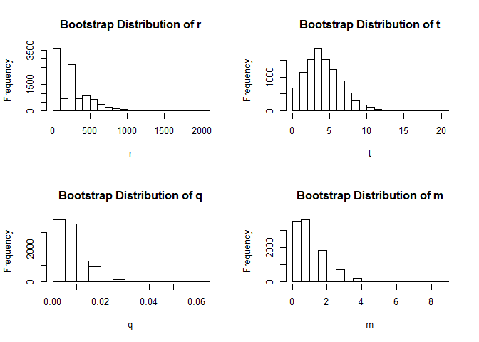

<!-- README.md is generated from README.Rmd. Please edit that file -->

# cwtr

<!-- badges: start -->

[](https://www.repostatus.org/#wip)
<!-- badges: end -->

This R package allows for simple calculation of CWT estimates and
bootstrap intervals for tag recovery and sampling in fisheries.

<br>

## Installation

You can install the development version of cwtr from
[GitHub](https://github.com/) with:

``` r
# install.packages("remotes")
remotes::install_github("justinpriest/cwtr")
```

<br>

## Example Usage

cwtr allows you to quickly calculate point estimates using the function
`cwtEst()`.

``` r
 library(cwtr) 
 x <- cwtEst(N=c(33666,NA), n=7618, 
             lambda=c(138,140,116,116), m=1, theta=c(0.01886,102.15))
 summary(x) 
#> Point Estimates Summary:
#>       Estimate  Variance      SE    CV   CI_lwr  CI_upp
#> r.est  237.716 56279.662 237.233 0.998 -152.498 627.930
#> t.est    4.483    15.617   3.952 0.881   -2.017  10.983
#> q.est    0.007     0.000   0.007 0.998   -0.005   0.019
#> 
#> NOTE:
#> r is the # of fish caught
#> t is the # of tagged fish caught
#> q is the % of fish caught
```

<br>

The function `cwtBoot()` calculates bootstrapped intervals for the cwt
estimates and can be specified for different methods.

``` r
library(cwtr)
x <- cwtEst(N=c(33666,NA), n=7618, 
            lambda=c(138,140,116,116), m=1, theta=c(0.01886,102.15))
xBoot <- cwtBoot(x, method="parametric", nreps=10000)
summary(xBoot)
#> Point Estimates Summary:
#>       Estimate  Variance      SE    CV   CI_lwr  CI_upp
#> r.est  237.716 56279.662 237.233 0.998 -152.498 627.930
#> t.est    4.483    15.617   3.952 0.881   -2.017  10.983
#> q.est    0.007     0.000   0.007 0.998   -0.005   0.019
#> 
#> Bootstrap Estimates Summary:
#>        Mean     Variance SE       CV        Bias      CI_lwr CI_uppr 
#> r.boot 243.2929 58026.77 240.8875 0.9901131 5.577205  0      694.1261
#> t.boot 4.6905   5.517662 2.34897  0.5007932 0.2071825 1      9       
#> m.boot 1.061    1.10759  1.052421 0.9919141 1.053939  0      3       
#> 
#> NOTE:
#> r is the # of fish caught
#> t is the # of tagged fish caught
#> q is the % of fish caught
```

<br>

These data are of class `cwt` which allows for simple use of the plot
method to generate plots of the bootstrap simulation:

``` r
library(cwtr)
x <- cwtEst(N=c(33666,NA), n=7618, 
            lambda=c(138,140,116,116), m=1, theta=c(0.01886,102.15)) 
xBoot <- cwtBoot(x, method="parametric", nreps=10000)
plot(xBoot) 
```


